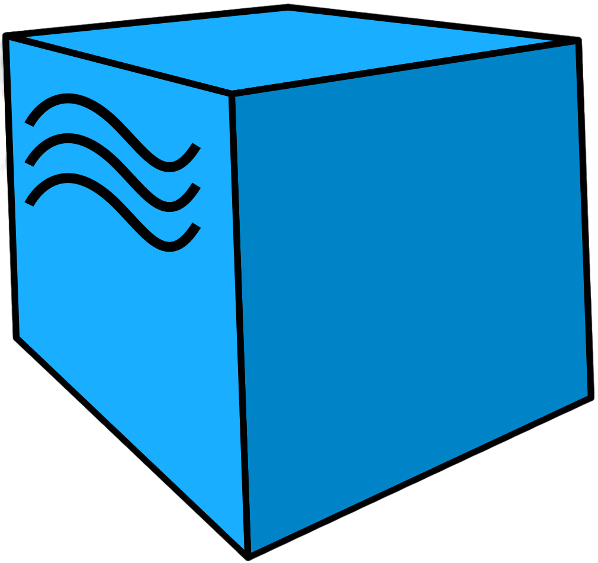
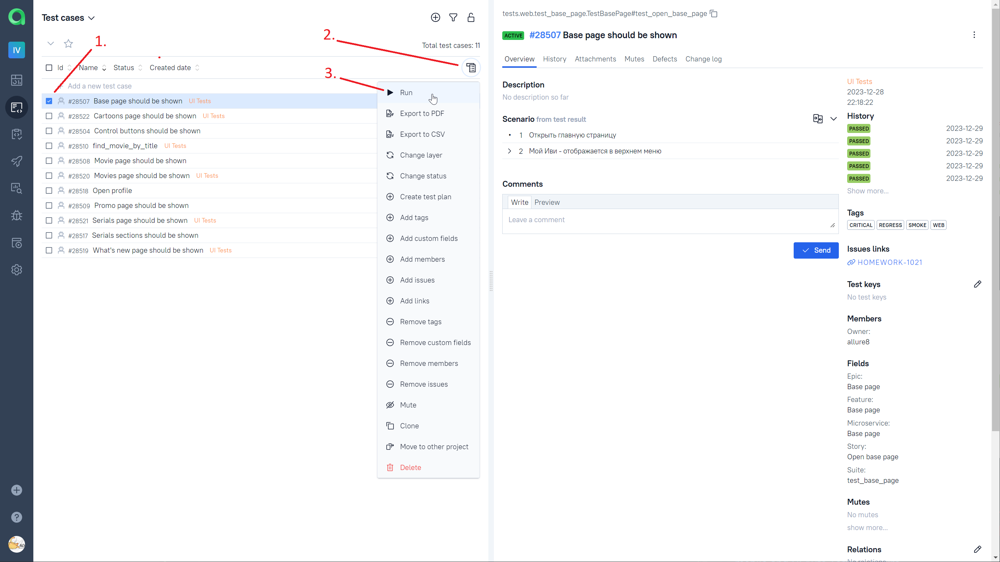

# Фреймворк для автоматизации тестирования сайта и мобильного приложения "Онлайн кинотеатр Ivi"
> <a target="_blank" href="https://www.ivi.ru/">ivi.ru</a>


----

### Особенности проекта

* Оповещения о тестовых прогонах в Telegram
* Отчеты с видео, скриншотом, логами, исходной моделью разметки страницы
* Сборка проекта в Jenkins
* Отчеты Allure Report
* Интеграция с Allure TestOps
* Автоматизация отчетности о тестовых прогонах и тест-кейсах в Jira
* Запуск web/UI автотестов в Selenoid
* Запуск mobile автотестов в BrowserStack
* Для запуска mobile автотестов используется Appium

### Список проверок, реализованных в web/UI автотестах

- [x] Главная страница сайта отображается
- [x] Страница фильма отображается
- [x] Промо страница отображается
- [x] Найти фильм в поиске возможно
- [x] Раздел "Что нового" отображается
- [x] Открыть страницу "Фильмы" через верхнее меню возможно
- [x] Открыть страницу "Сериалы" через верхнее меню возможно
- [x] Открыть страницу "Мультфильмы" через верхнее меню возможно

### Список проверок, реализованных в mobile автотестах

- [x] Элементы управления отображаются
- [x] Раздел "Сериалы" отображается
- [x] Раздел "Профиль" отображается

----

### Используемый стэк

             

----

### Локальный запуск автотестов

#### Для запуска web/UI автотестов выполнить в cli:
> [!NOTE]
> Ключ выбора версии `--browser-version` не обязателен
```bash
python -m venv .venv
source .venv/bin/activate
pip install -r requirements.txt
pytest --browser-version=100 ./tests/web/
```

#### Для запуска mobile автотестов выполнить в cli:
> [!NOTE]
> Ключ `--context` не обязателен, по умолчанию тесты будут запущены на BrowserStack
* Для запуска на реальном устройстве указать ключ `--context=local_real_device`
* Для запуска на виртуальном устройстве указать ключ `--context=local_real_device`
* Для запуска на BrowserStack указать ключ `--context=bstack`

```bash
python -m venv .venv
source .venv/bin/activate
pip install -r requirements.txt
pytest --context=bstack ./tests/mobile/
```

#### Для запуска всех автотестов выполнить в cli:

```bash
python -m venv .venv
source .venv/bin/activate
pip install -r requirements.txt
pytest -s -v
```

#### Получение отчёта:
```bash
allure serve build/allure-results
```

----

### Проект в Jenkins
> <a target="_blank" href="https://jenkins.autotests.cloud/job/Ivi-mobile-and-UI-Auto-Tests/">Ссылка</a>

#### Параметры сборки
> [!NOTE]
> Параметры сборки не обязательны
```python
ENVIRONMENT = ['STAGE', 'PREPROD', 'PROD'] # Окружение
COMMENT = 'some comment' # Комментарий
```
#### Запуск автотестов в Jenkins
1. Открыть <a target="_blank" href="https://jenkins.autotests.cloud/job/Ivi-mobile-and-UI-Auto-Tests/">проект</a>


2. Нажать "Build with Parameters"
3. Из списка "ENVIRONMENT" выбрать любое окружение
4. В поле "COMMENT" ввести комментарий
5. Нажать "Build"


----

### Allure отчет
#### <a target="_blank" href="https://jenkins.autotests.cloud/job/Ivi-mobile-and-UI-Auto-Tests/15/allure/">Общие результаты</a>


#### <a target="_blank" href="https://jenkins.autotests.cloud/job/Ivi-mobile-and-UI-Auto-Tests/15/allure/#suites">Результаты прохождения теста</a>


#### <a target="_blank" href="https://jenkins.autotests.cloud/job/Ivi-mobile-and-UI-Auto-Tests/15/allure/#graph">Графики</a>


----

### Интеграция с Allure TestOps
> <a target="_blank" href="https://allure.autotests.cloud/project/3910/dashboards">Ссылка на проект</a>

#### <a target="_blank" href="https://allure.autotests.cloud/project/3910/dashboards">Дашборд с общими показателями тестовых прогонов</a>


#### <a target="_blank" href="https://allure.autotests.cloud/project/3910/launches">История запуска тестовых наборов</a>


#### <a target="_blank" href="https://allure.autotests.cloud/project/3910/test-cases/28510?treeId=0">Тест кейсы</a>


#### <a target="_blank" href="https://allure.autotests.cloud/launch/33573/tree/551292/attachments?treeId=0">Тестовые артефакты</a>


#### <a target="_blank" href="https://allure.autotests.cloud/project/3910/test-cases/28510?treeId=0">Ручной запуск авто теста из Allure TestOps</a>



1. Нажать на чек-бокс необходимого тест кейса
2. Нажать на "Bulk actions"
3. Нажать на "Run"

----

### Интеграция с Jira
> <a target="_blank" href="https://jira.autotests.cloud/browse/HOMEWORK-1021">Ссылка на проект</a>


----

### Оповещения в Telegram


----

### Видео прохождения web/UI автотеста


----

### Видео прохождения mobile автотеста
